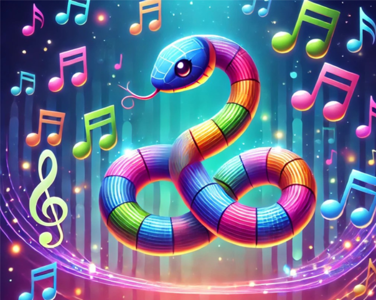

# MUSICAL SNAKE

Chào mừng bạn đến với **MUSICAL SNAKE**, một trò chơi rắn săn mồi kết hợp âm nhạc! 🐍🎵 Game được phát triển bằng C++ sử dụng thư viện SDL2, mang đến trải nghiệm thú vị với chế độ Giao hưởng (Symphony Mode) độc đáo.

## Giới thiệu game

Trong **MUSICAL SNAKE**, bạn sẽ điều khiển một con rắn di chuyển trên màn hình để ăn các nốt nhạc. Mỗi nốt nhạc bạn ăn đúng sẽ tăng điểm số, và nếu bạn ăn đủ một chuỗi nốt nhạc theo đúng thứ tự, bạn sẽ kích hoạt **Chế độ Giao hưởng**. Trong chế độ này, bạn cần thu thập 20 nốt vàng trong vòng 30 giây để chiến thắng. Hãy cẩn thận để không đâm vào tường hoặc thân rắn, nếu không game sẽ kết thúc!

## Tính năng nổi bật
- **Chơi có điều kiện**: Điều khiển rắn bằng phím mũi tên (Lên, Xuống, Trái, Phải) trên lưới 20x20 ô.  
- **Chế độ Hướng dẫn Nốt (Note Guiding Mode)**: Rắn phải ăn các nốt nhạc theo thứ tự gợi ý( nốt nhạc lắc lư), ăn đúng sẽ tích lũy thêm 1 nốt nhạc đúng .  
- **Chế độ Giao hưởng (Symphony Mode)**: Khi ăn đủ chuỗi 5 nốt theo thứ tự, tất cả nốt biến thành nốt vàng (`gold_note.png`), người chơi phải thu thập 20 nốt vàng trong 30 giây để chiến thắng.  
- **Hiệu ứng âm thanh**: Mỗi nốt nhạc phát âm thanh riêng (nốt ĐÔ phát `C.mp3`, nốt RÊ phát `D.mp3`, ...), nốt vàng phát `gold.mp3`, nhạc nền (`music.mp3`), nhạc giao hưởng (complete.mp3) tạo không khí vui nhộn.  
- **Hiệu ứng hình ảnh**: Particle xuất hiện khi rắn ăn nốt đúng thứ tự chuỗi hoặc ăn nốt vàng trong chế độ giao hưởng, quản lý bởi `EffectManager`, làm game sinh động hơn.  
- **Hệ thống điểm số và UI**: Hiển thị điểm số, thời gian, số nốt đã ăn trong chế độ giao hưởng trên màn hình, thông báo "YOU WIN" (màu xanh lá) khi thắng, "YOU LOSE" (màu đỏ) khi thua.  
- **Màn hình chào**: Hiển thị màn hình chào (`splashScreen`) khi khởi động game, tạo ấn tượng chuyên nghiệp.

## Các bước cài đặt và chạy game

Để chạy game **Rắn Săn Mồi**, bạn cần chuẩn bị môi trường và làm theo các bước sau:

### 1. Chuẩn bị môi trường

#### Yêu cầu
- Trình biên dịch C++: `g++` (MinGW cho Windows, GCC cho Linux/Mac).  
- Thư viện SDL2:  
  - `SDL2`  
  - `SDL2_image`  
  - `SDL2_ttf`  
  - `SDL2_mixer`  

#### Cài đặt SDL2

- **Ubuntu/Linux**:  
  - Cài đặt các thư viện SDL2:  
    ```bash
    sudo apt-get update
    sudo apt-get install g++ libsdl2-dev libsdl2-image-dev libsdl2-ttf-dev libsdl2-mixer-dev
Kiểm tra cài đặt:
bash

Sao chép
sdl2-config --version
Nếu lệnh trên trả về phiên bản SDL2 (ví dụ: 2.0.12), bạn đã cài đặt thành công.
Windows:
Tải các thư viện SDL2 từ libsdl.org:
SDL2-devel-*.zip (SDL2).
SDL2_image-devel-*.zip (SDL2_image).
SDL2_ttf-devel-*.zip (SDL2_ttf).
SDL2_mixer-devel-*.zip (SDL2_mixer).
Giải nén và đặt vào một thư mục, ví dụ: C:\SDL2.
Cấu hình MinGW: Đảm bảo g++ đã được cài đặt (tải từ MinGW).
Thêm đường dẫn C:\SDL2\bin vào biến môi trường Path để chạy file thực thi.
macOS:
Sử dụng Homebrew để cài đặt:
bash

Sao chép
brew install sdl2 sdl2_image sdl2_ttf sdl2_mixer
2. Tải mã nguồn từ repository
Clone repository từ GitHub:
bash

Sao chép
git clone https://github.com/DovietHoang24021483/SNAKEGAMEEEE.git
cd SNAKEGAMEEEE
Lưu ý:
Đảm bảo tất cả file tài nguyên (hình ảnh: snake_head.png, note.png, ...; âm thanh: C.mp3, music.mp3, ...) đã được tải về cùng mã nguồn. Các file này nằm trong thư mục gốc của repository.
3. Biên dịch mã nguồn
Biên dịch game bằng g++. Sử dụng lệnh phù hợp với hệ điều hành của bạn:
Ubuntu/Linux hoặc macOS (nếu SDL2 cài đặt toàn cục):
bash

Sao chép
g++ -o RắnSănMồi main.cpp PlayGround.cpp Snake.cpp -lSDL2 -lSDL2_image -lSDL2_ttf -lSDL2_mixer
Windows (cần chỉ định đường dẫn thư viện):
Nếu bạn đặt SDL2 trong C:\SDL2, sử dụng lệnh:
bash

Sao chép
g++ -o RắnSănMồi main.cpp PlayGround.cpp Snake.cpp -I"C:/SDL2/include" -L"C:/SDL2/lib" -lmingw32 -lSDL2main -lSDL2 -lSDL2_image -lSDL2_ttf -lSDL2_mixer
Lưu ý:
Đảm bảo các file .cpp (main.cpp, PlayGround.cpp, Snake.cpp, ...) có trong thư mục hiện tại.
Nếu gặp lỗi biên dịch (ví dụ: "undefined reference to SDL_..."), kiểm tra lại đường dẫn thư viện hoặc cài đặt SDL2.
4. Chạy game
Chạy file thực thi vừa biên dịch:
Linux/macOS:
bash

Sao chép
./RắnSănMồi
Windows:
bash

Sao chép
RắnSănMồi.exe
Lưu ý:
Nếu gặp lỗi "SDL2.dll not found" trên Windows, sao chép file SDL2.dll, SDL2_image.dll, SDL2_ttf.dll, SDL2_mixer.dll từ thư mục C:\SDL2\bin vào thư mục chứa file RắnSănMồi.exe.

## Cách chơi

- **Điều khiển**:
- Sử dụng **phím mũi tên** để điều khiển hướng rắn (Lên, Xuống, Trái, Phải).
- Nhấn **Enter** để chơi lại sau khi thắng hoặc thua.
- Nhấn **Escape** để thoát game.
- **Mục tiêu**:
- Ăn các nốt nhạc theo đúng thứ tự để tăng điểm.
- Hoàn thành chuỗi 5 nốt nhạc để kích hoạt **Chế độ Giao hưởng**.
- Trong Chế độ Giao hưởng, thu thập 20 nốt vàng trong 50 giây để chiến thắng.
- **Kết thúc game**:
- Game kết thúc nếu rắn đâm vào tường hoặc thân của chính nó.
- Trong Chế độ Giao hưởng, nếu không thu thập đủ 20 nốt vàng trong thời gian quy định, game sẽ quay lại chế độ thường.

## Cấu trúc dự án

- `main.cpp`: Vòng lặp game chính và khởi tạo game.
- `PlayGround.cpp`/`PlayGround.h`: Quản lý bàn chơi, nốt nhạc, và trạng thái game.
- `Snake.cpp`/`Snake.h`: Xử lý di chuyển, va chạm, và logic ăn nốt của rắn.
- `Renderer.h`: (Giả định) Vẽ game bằng SDL2.
- `AudioManager.h`: (Giả định) Quản lý âm thanh.
- `EffectManager.h`: (Giả định) Quản lý hiệu ứng hình ảnh.
## Video Demo

[](https://drive.google.com/file/d/1wJZqMY2ubDd3J9o0iFIhTOKgP8QE-0pd/view?usp=drive_link)
## Hình ảnh minh họa



## Đóng góp

Nếu bạn muốn đóng góp vào dự án, hãy fork repository này, thực hiện cải tiến, và gửi pull request! Nếu bạn tìm thấy lỗi hoặc có gợi ý, vui lòng mở một issue.

## Giấy phép

Dự án này sử dụng **MIT License** - xem file LICENSE để biết thêm chi tiết.

## Lời cảm ơn

- Cảm hứng từ các game rắn cổ điển.
- Cảm ơn cộng đồng SDL2 đã cung cấp các thư viện tuyệt vời để phát triển game.
