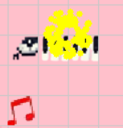
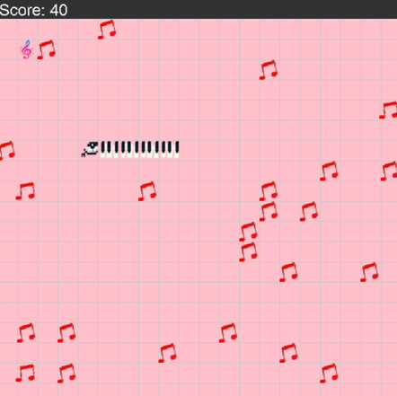
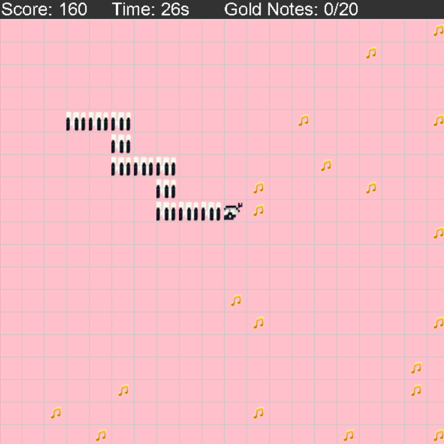
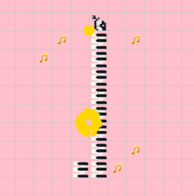
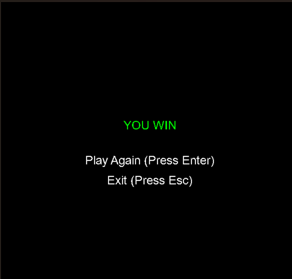
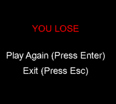

[[English]](README_en.md)

# MUSICAL SNAKE

- # VIDEO DEMO GAME MUSICAL SNAKE: [video](https://drive.google.com/file/d/1SJJjfO1ky3_pscMocCVaDnSrGC5NMzTe/view?usp=drive_link)
# Giới thiệu game
**MUSICAL SNAKE** là một tựa game arcade đầy sáng tạo, nơi âm nhạc và gameplay hòa quyện để mang đến trải nghiệm giải trí độc đáo! Được phát triển bằng C++ và thư viện SDL2, game là phiên bản nâng cấp của Snake cổ điển, đưa bạn vào hành trình điều khiển chú rắn trên lưới 20x20 ô để "săn" các nốt nhạc. Không chỉ đơn thuần là ăn mồi, bạn sẽ được đắm mình trong các giai điệu sống động, vượt qua những thử thách ở Chế độ Hướng dẫn Nốt, và chinh phục Chế độ Giao hưởng để thu thập 20 nốt vàng trong 30 giây kịch tính. Với đồ họa bắt mắt, hiệu ứng mượt mà, và âm thanh cuốn hút, **MUSICAL SNAKE** hứa hẹn sẽ làm bạn không thể rời mắt!

- [0. Cách tải game](#0-cách-tải-game)
    * [a. Cách 1: Không bao gồm code.](#a-cách-1-không-bao-gồm-code)
    * [b. Cách 2: Bao gồm code và có thể biên dịch.](#b-cách-2-bao-gồm-code-và-có-thể-biên-dịch)
- [1. Bắt đầu game](#1bắt-đầu-game)
- [2. Các thành phần trong game:](#3-các-thành-phần-trong-game)
- [3. Cách chơi](#4-cách-chơi)
- [4. Chiến thắng và thất bại](#5-chiến-thắng-và-thất-bại)
- [Về source code game](#về-source-code-game)

 # 0. Cách tải game

## a. Cách 1: Không bao gồm code

- Tải game (được nén thành `.zip`) tại link sau: [Link tải game](https://github.com/DovietHoang24021483/SNAKEGAMEEEE/releases)  
  - Cách này tiết kiệm bộ nhớ và thời gian tải (khoảng 10MB, tùy thuộc vào kích thước file của bạn).  
- Giải nén game vào một thư mục.  
- Chạy file `RắnSănMồi.exe` để chơi ngay.

## b. Cách 2: Bao gồm code và có thể biên dịch

- **Bước 1: Clone repository**  
  - Clone repository từ GitHub (khoảng 50MB, tùy thuộc vào lịch sử phiên bản):  
    ```bash
    git clone https://github.com/DovietHoang24021483/SNAKEGAMEEEE.git
    cd SNAKEGAMEEEE
Hoặc chọn Code -> Download ZIP (khoảng 20MB, tùy thuộc vào kích thước).
Tất cả code nằm trong thư mục gốc (các file như main.cpp, PlayGround.cpp, Snake.cpp, ...).
Nếu không muốn biên dịch, bạn có thể nhảy đến Bước 5 để chơi ngay.
-**Bước 2**: Cài đặt MinGW
     
     -Cài đặt MinGW để có trình biên dịch g++. Bạn có thể tải phiên bản MinGW-W64 từ sourceforge.net.
     
     -Lưu ý:
         
         -Đảm bảo g++ được thêm vào biến môi trường Path để sử dụng trong command line.
-**Bước 3**: Cài đặt thư viện SDL2
        
        -Cần cài các thư viện SDL2 (SDL2, SDL2_image, SDL2_ttf, SDL2_mixer). Xem chi tiết ở phần Các bước cài đặt và chạy game bên dưới.
-**Bước 4**: Biên dịch game
       
       -Mở terminal (hoặc Command Prompt) trong thư mục chứa các file code.
        
       -Sử dụng lệnh biên dịch phù hợp:
      
       -Windows:

            -g++ -o RắnSănMồi main.cpp PlayGround.cpp Snake.cpp -I"C:/SDL2/include" -L"C:/SDL2/lib" -lmingw32 -lSDL2main -lSDL2 -lSDL2_image -lSDL2_ttf -lSDL2_mixer
       
       -Linux/macOS:

            -g++ -o RắnSănMồi main.cpp PlayGround.cpp Snake.cpp -lSDL2 -lSDL2_image -lSDL2_ttf -lSDL2_mixer

-**Bước 5**: Chạy game

        -Chạy file thực thi:

        -Windows: RắnSănMồi.exe
        
        -Linux/macOS: ./RắnSănMồi

-**Lưu ý**: Nếu gặp lỗi "SDL2.dll not found" trên Windows, sao chép các file .dll (SDL2.dll, SDL2_image.dll, SDL2_ttf.dll, SDL2_mixer.dll) từ thư mục C:\SDL2\bin vào thư mục chứa file RắnSănMồi.exe.


# 1. Bắt đầu game

Chờ một chút rồi ấn phím bất kì hoặc kích chuột để bắt đầu chơi game.


# 2. Các thành phần trong game:

-Đầu rắn mang âm hưởng âm nhạc

 

-Đốt rắn là những phím đàn piano 


-Note nhạc thường màu đỏ : Ăn đúng nốt sẽ được thêm độ dài , tăng điểm , phát âm thanh của note đó, sai nốt rắn không dài ra, bị chậm lại , phát âm thanh fail


-Note nhạc tăng tốc độ 


-Note nhac vàng : Trong chế độ bản giao hưởng ăn mỗi lần được cộng 100 điểm 
 
 

 -BackGround nhẹ nhàng , thanh thoát , mang tính giải stress khi hòa cùng âm nhạc đồng thời màu nhẹ giúp làm nổi nốt nhạc và rắn 


# 3. Cách chơi 
 -**Chế độ thường**
     
     - Điều khiển rắn sang trái, sang phải, lên xuống bằng cách dùng phím tương ứng

     - Cố gắng không cho rắn đâm vào tường và vào thân 
     
     - Cố gắng ăn nốt đúng thứ tứ ( nốt đang rung ) để có cơ hội tích lũy đủ chuỗi nốt 5 nốt nhạc để vào được bản giao hưởng

     - Ăn đúng nốt nhạc rắn sẽ dài ra , đồng thời phát âm thanh của note nhạc đó , vằ được cộng thêm 10 điểm và bắn pháo hoa màu vàng



     - Tránh ăn sai nốt nhạc rắn sẽ ko dài ra , đồng thời tốc độ bị giảm và ko được cộng điểm 

     -Hình ảnh sơ bộ chế độ thường 



-**Chế độ bản giao hưởng(SYMPHONY)**

  **Mục tiêu** :
       
       -Ăn hết 20 nốt nhạc vàng trong vòng 30 giây 

       -Ăn một nốt sẽ cộng 100 điểm và bắn pháo bông lớn ăn đủ 20 cộng 500 điểm
         
       -Nếu không hết quay lại chế độ thường để chơi lại để tiếp tục cố gẳng để chinh phục bản giao hưởng ở lần tiếp theo

 Hình ảnh sơ bộ chế độ bản giao hưởng (SYMPHONY)





# 5. Chiến thắng và thất bại

-**Chiến thắng** : Game win khi người chơi chinh phục được đủ 20 note nhạc ở chế độ bản giao hưởng 



-**Thua cuộc** : Thua khi rắn đâm vào tường hoặc vào thân 



### Về source code game
  -main.cpp:
     
      -Chứa hàm main(), khởi tạo window, renderer, và vòng lặp game chính.
      
      -Xử lý các sự kiện, cập nhật trạng thái game, và vẽ các thành phần lên màn hình.

  -PlayGround.cpp/PlayGround.h:
      
      -Quản lý khu vực chơi:

      -Khởi tạo lưới 20x20 ô cho màn chơi.

      -Quản lý vị trí và trạng thái của các nốt nhạc (note.png, noteTarget.png, gold_note.png).
      
      -Xử lý các chế độ chơi (Chế độ Hướng dẫn Nốt và Chế độ Giao hưởng).
 
      -Tạo ngẫu nhiên vị trí nốt nhạc trên lưới.
  
  -Snake.cpp/Snake.h:
     
     -Quản lý rắn:
      
     -Xử lý di chuyển của rắn (dùng phím mũi tên).

     -Kiểm tra va chạm (với chính rắn hoặc với nốt nhạc).

     -Logic ăn nốt: tăng chiều dài rắn và phát âm thanh (C.mp3, gold.mp3, ...).

     -Xoay đầu rắn (snake_head.png) theo hướng di chuyển.

  -AudioManager.cpp/AudioManager.h :
  
      -Quản lý âm thanh:
     
      -Tải và phát nhạc nền (music.mp3).
      
      -Phát âm thanh khi rắn ăn nốt nhạc (C.mp3, D.mp3, ..., gold.mp3).
       
      -Sử dụng SDL2_mixer để xử lý âm thanh.

  -EffectManager.cpp/EffectManager.h :
      
      -Quản lý hiệu ứng:
      
      -Tạo particle khi rắn ăn nốt nhạc.
      
      -Xử lý các hiệu ứng hình ảnh khác (nếu có).
      
      -Thư mục tài nguyên (giả định: resources/):
      
 - tất cả tài nguyên của game:
     
    - Hình ảnh: snake_head.png, snake_body.png, note.png, noteTarget.png, gold_note.png, backgroundTexture.

     -Âm thanh: C.mp3, D.mp3, ..., gold.mp3, music.mp3.

   -Sử dụng SDL2, SDL2_image để tải và vẽ ảnh; SDL2_ttf để vẽ chữ (ví dụ: "YOU WIN", "YOU LOSE").
   
   Xử lý sự kiện (trong main.cpp):

   Xử lý các sự kiện bàn phím:

   Phím mũi tên: Điều khiển rắn (Lên, Xuống, Trái, Phải).

   Phím Enter: Chơi lại khi thắng hoặc thua.

   Phím Escape: Thoát game.

   Quản lý trạng thái game (chuyển đổi giữa màn hình chào, màn chơi, và màn kết thúc).

  Quản lý trạng thái game (trong PlayGround.cpp):

  Cập nhật trạng thái game theo từng khung hình:
  
  Di chuyển rắn, kiểm tra va chạm, tạo nốt nhạc mới.
 
 Chuyển đổi giữa các chế độ (Hướng dẫn Nốt, Giao hưởng).
  
  Hiển thị điểm số và thông báo kết thúc ("YOU WIN", "YOU LOSE").
       

   
