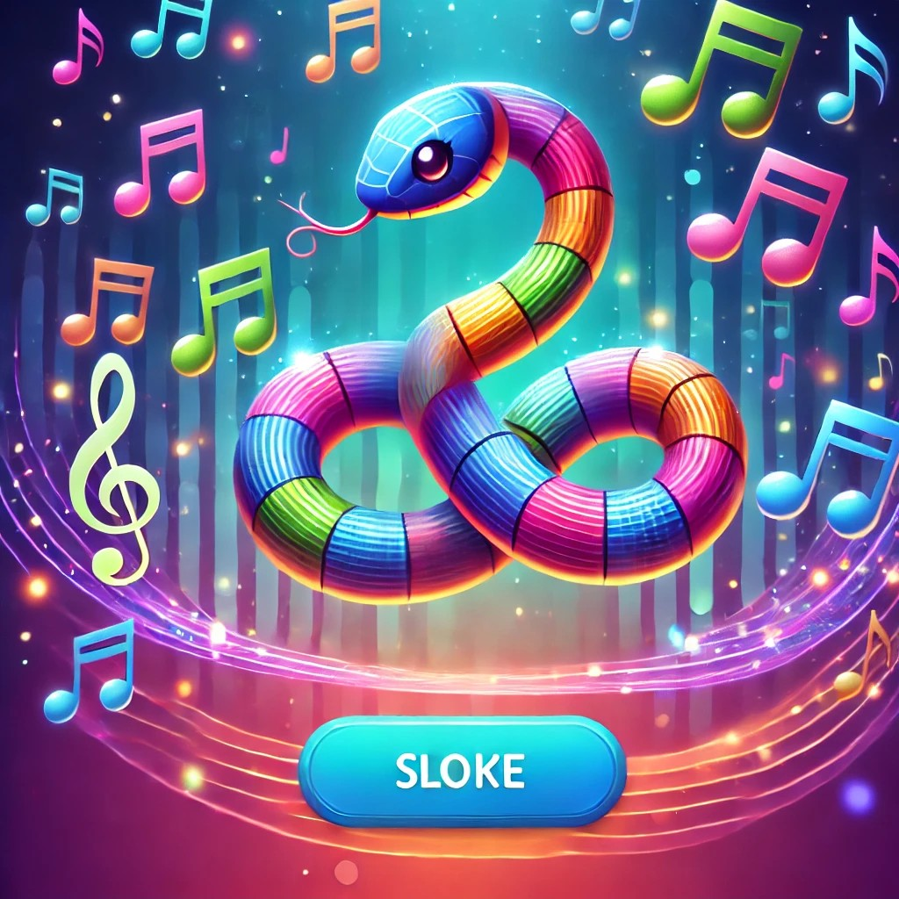
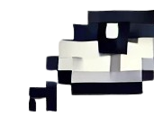
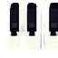

[[English]](README_en.md)

# MUSICAL SNAKE

- Thử nghiệm game: [https://youtu.be/EyTwTOWr5zU](https://youtu.be/EziCb7U9UbU)
- Phá đảo game: https://youtu.be/0RQHeCaz4sg

# Giới thiệu game
**MUSICAL SNAKE** là một tựa game arcade đầy sáng tạo, nơi âm nhạc và gameplay hòa quyện để mang đến trải nghiệm giải trí độc đáo! Được phát triển bằng C++ và thư viện SDL2, game là phiên bản nâng cấp của Snake cổ điển, đưa bạn vào hành trình điều khiển chú rắn trên lưới 20x20 ô để "săn" các nốt nhạc. Không chỉ đơn thuần là ăn mồi, bạn sẽ được đắm mình trong các giai điệu sống động, vượt qua những thử thách ở Chế độ Hướng dẫn Nốt, và chinh phục Chế độ Giao hưởng để thu thập 20 nốt vàng trong 30 giây kịch tính. Với đồ họa bắt mắt, hiệu ứng mượt mà, và âm thanh cuốn hút, **MUSICAL SNAKE** hứa hẹn sẽ làm bạn không thể rời mắt!

- [0. Cách tải game](#0-cách-tải-game)
    * [a. Cách 1: Không bao gồm code.](#a-cách-1-không-bao-gồm-code)
    * [b. Cách 2: Bao gồm code và có thể biên dịch.](#b-cách-2-bao-gồm-code-và-có-thể-biên-dịch)
- [1. Bắt đầu game](#1bắt-đầu-game)
- [3. Các thành phần trong game:](#3-các-thành-phần-trong-game)
- [4. Cách chơi](#4-cách-chơi)
- [5. Chiến thắng và thất bại](#5-chiến-thắng-và-thất-bại)
- [Về đồ họa của game:](#về-đồ-họa-của-game)
- [Về source code game](#về-source-code-game)

 # 0. Cách tải game

## a. Cách 1: Không bao gồm code

- Tải game (được nén thành `.zip`) tại link sau: [Link tải game](https://github.com/DovietHoang24021483/SNAKEGAMEEEE/releases)  
  - Cách này tiết kiệm bộ nhớ và thời gian tải (khoảng 10MB, tùy thuộc vào kích thước file của bạn).  
- Giải nén game vào một thư mục.  
- Chạy file `RắnSănMồi.exe` để chơi ngay.

## b. Cách 2: Bao gồm code và có thể biên dịch

- **Bước 1: Clone repository**  
  - Clone repository từ GitHub (khoảng 50MB, tùy thuộc vào lịch sử phiên bản):  
    ```bash
    git clone https://github.com/DovietHoang24021483/SNAKEGAMEEEE.git
    cd SNAKEGAMEEEE
Hoặc chọn Code -> Download ZIP (khoảng 20MB, tùy thuộc vào kích thước).
Tất cả code nằm trong thư mục gốc (các file như main.cpp, PlayGround.cpp, Snake.cpp, ...).
Nếu không muốn biên dịch, bạn có thể nhảy đến Bước 5 để chơi ngay.
-**Bước 2**: Cài đặt MinGW
     
     -Cài đặt MinGW để có trình biên dịch g++. Bạn có thể tải phiên bản MinGW-W64 từ sourceforge.net.
     
     -Lưu ý:
         
         -Đảm bảo g++ được thêm vào biến môi trường Path để sử dụng trong command line.
-**Bước 3**: Cài đặt thư viện SDL2
        
        -Cần cài các thư viện SDL2 (SDL2, SDL2_image, SDL2_ttf, SDL2_mixer). Xem chi tiết ở phần Các bước cài đặt và chạy game bên dưới.
-**Bước 4**: Biên dịch game
       
       -Mở terminal (hoặc Command Prompt) trong thư mục chứa các file code.
        
       -Sử dụng lệnh biên dịch phù hợp:
      
       -Windows:

            -g++ -o RắnSănMồi main.cpp PlayGround.cpp Snake.cpp -I"C:/SDL2/include" -L"C:/SDL2/lib" -lmingw32 -lSDL2main -lSDL2 -lSDL2_image -lSDL2_ttf -lSDL2_mixer
       
       -Linux/macOS:

            -g++ -o RắnSănMồi main.cpp PlayGround.cpp Snake.cpp -lSDL2 -lSDL2_image -lSDL2_ttf -lSDL2_mixer

-**Bước 5**: Chạy game

        -Chạy file thực thi:

        -Windows: RắnSănMồi.exe
        
        -Linux/macOS: ./RắnSănMồi

-**Lưu ý**: Nếu gặp lỗi "SDL2.dll not found" trên Windows, sao chép các file .dll (SDL2.dll, SDL2_image.dll, SDL2_ttf.dll, SDL2_mixer.dll) từ thư mục C:\SDL2\bin vào thư mục chứa file RắnSănMồi.exe.


# 1. Bắt đầu game

Chờ một chút rồi ấn phím bất kì hoặc kích chuột để bắt đầu chơi game.



# 2. Các thành phần trong game:

-Đầu rắn mang âm hưởng âm nhạc

 

-Đốt rắn là những phím đàn piano 


-Note nhạc thường màu đỏ : Ăn đúng nốt sẽ được thêm độ dài , tăng điểm , phát âm thanh của note đó, sai nốt rắn không dài ra, bị chậm lại , phát âm thanh fail


-Note nhạc tăng tốc độ 


-Note nhac vàng : Trong chế độ bản giao hưởng ăn mỗi lần được cộng 100 điểm 
 
 

 -BackGround nhẹ nhàng , thanh thoát , mang tính giải stress khi hòa cùng âm nhạc đong thời màu nhẹ giúp làm nổi nốt nhạc và rắn 


